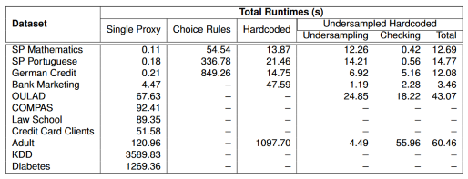
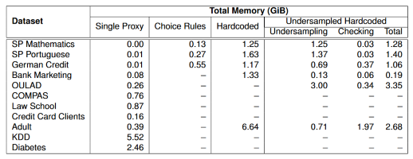

# Proxy-Detection-with-Logical-Reasoning

## Overview

This repository contains the source code and documentation for methods and algorithms developed as part of a Master Thesis on Resoning over Indirect Discrimination under the supervision of Dr. Filipe Gouveia and Prof. Inês Lynce. The part of the research included here focuses on using [Potassco](https://potassco.org/)'s [clingo](https://potassco.org/clingo/) to find relationships in tabular datasets that point to proxies of protected attributes. 

## Introduction

Artificial Intelligence (AI) relies on identifying and replicating patterns, and its effectiveness depends on the quality of the data it learns from. However, data often contains biases that can lead to unfair outcomes in AI-driven decisions.
There are challenges in addressing **structural bias in data**, especially concerning protected attributes such as gender and race. Particularly in identifying proxies for these attributes. Even if, for example, the protected attributes are removed from data prior to training Machine Learning (ML) models, **proxy attributes** can (unknowingly) reinforce biases from the protected attributes. Therefore, this work focused on finding logical methods to discover proxy attributes in data.

## Methods

The methods that are presented in this repository do not represent the full research scope, but instead the approaches that were deemed the most realistic in terms of real-world usage. All are clingo-based and either use clingo as a stand-alone application or through the [clingo module](https://potassco.org/clingo/python-api/5.4/) for [Python](https://www.python.org/).

To find the potential proxy attributes, we retrieve attributes that imply protected attributes.
For example, let us take a look at the German Credit dataset where the protected attribute is `age_cat` (as in age category). 
88% of the times where the value for the attribute `credit_history` is `critical/other existing credit`, the value for `age_cat` is `old`. Furthermore, 29% of the records in the dataset, have a value of `critical/other existing credit` for the attribute `credit_history`. Hence, we say that `credit_history = critical/other existing credit` implies `age_cat = old` with a probability of 88% and an incidence of 29%.

In the [Notebook](https://jupyter.org/) file [`proxy_detect.ipynb`](https://github.com/marianacintrao/Proxy-Detection-with-Logical-Reasoning/blob/main/proxy_detect.ipynb), in this directory the four describe methods are:

**Single proxy discovery**

Returns all single attributes that imply a protected attribute.
Optionally customizeable minimum probability and incidence.

> Eg.: `implication("credit_history","critical/other existing credit","age_cat","old",88,29)`

✔️ Fast

✔️ Able to process all tested datasets under the memory limit of 8GiB

✖️ Does not return proxy clusters, just single proxies

**_Choice Rules_ multiple proxy discovery**

Returns all proxy clusters of attributes that imply a protected attribute.
Optionally customizeable minimum probability, incidence, and cluster minimum and maximum size.

> Eg.: `proxy("credit_history","critical/other existing credit") proxy("housing","own") proxy("foreign_worker","yes") implication("age_cat","old",90,21) count_attributes_in_cluster(3)`

✔️ Returns proxy clusters

✔️ Easy to customize preferences

✖️ Slowest multi-proxy approach (out of the 3)

✖️ Unable to process most datasets under the memory limit of 8GiB

**_Hardcoded_ multiple proxy discovery**

Returns all proxy clusters of attributes that imply a protected attribute. Not very straighforward to customize minimum probability, incidence, and cluster minimum and maximum size.

> Eg.: `implication("credit_history","critical/other existing credit","housing","own","foreign_worker","yes","age_cat","old",90,21)`

✔️ Returns proxy clusters

➕ Faster than _Choice Rules_ 

➕ More memory efficient than _Choice Rules_ 

✖️ Not easy to customize preferences

✖️ Still unable to process many of the tested datasets under the memory limit of 8GiB

**_Undersampled Hardcoded_ multiple proxy discovery**

Returns _some_ proxy clusters of attributes that imply a protected attribute. Not very straighforward to customize minimum probability, incidence, and cluster minimum and maximum size.

✔️ Returns proxy clusters

➕ Faster than _Choice Rules_ and _Hardcoded_

➕ More memory efficient than _Choice Rules_ and _Hardcoded_

✖️ Does not necessarily return all existing proxies given the specified preferences

✖️ Still unable to process some of the tested datasets under the memory limit of 8GiB

> Eg.: `implication("credit_history","critical/other existing credit","housing","own","foreign_worker","yes","age_cat","old",90,21)`

### Comparative performance

The tables below illustrate the performance of the algorithms under the same conditions: minimum **implication probability of 80%** and minimum **incidence probability of 1%**. Similarly, all but the single proxy method all retrieved proxy clusters of sizes 1 to 3. 

The maximum possible memory usage was set to 8GiB. The experiments signaled with `–` were ones that would have surpassed this memory limit.

All the mentioned test datasets are cited [below](#datasets).

## Datasets

Below we list the datasets in the `example_datasets` and `example_datasets_no_ordinals` directories. The datasets in these directories are however not necessarily the original ones as they have undergone transformations to better suit the tools used in this project.

* **Adult Census Income** - Becker, Barry and Kohavi, Ronny. (1996). Adult. UCI Machine Learning Repository. https://doi.org/10.24432/C5XW20.
* **Bank Marketing** - Moro, S., Rita, P., and Cortez, P.. (2012). Bank Marketing. UCI Machine Learning Repository. https://doi.org/10.24432/C5K306.
* **Correctional Offender Management Profiling for Alternative Sanctions (COMPAS)** - Angwin, J. et al.. (2016). Machine bias, ProPublica. Available at: https://www.propublica.org/article/machine-bias-risk-assessments-in-criminal-sentencing (Accessed: 14 September 2023). 
* **Credit Card Clients** - Yeh, I-Cheng. (2016). default of credit card clients. UCI Machine Learning Repository. https://doi.org/10.24432/C55S3H.
* **Diabetes** - Kahn, Michael. Diabetes. UCI Machine Learning Repository. https://doi.org/10.24432/C5T59G.
* **German Credit** - Hofmann,Hans. (1994). Statlog (German Credit Data). UCI Machine Learning Repository. https://doi.org/10.24432/C5NC77.
* **Census-Income KDD** - Census-Income (KDD). (2000). UCI Machine Learning Repository. https://doi.org/10.24432/C5N30T.
* **Law School** - Wightman, Linda. (1998) LSAC National Longitudinal Bar Passage Study. LSAC Research Report Series. Available at: http://www.seaphe.org/databases.php and https://www.kaggle.com/datasets/danofer/law-school-admissions-bar-passage (Accessed: 14 September 2023). 
* **Open University Learning Analytics (OULAD)** - Kuzilek J., Hlosta M., Zdrahal Z. Open University Learning Analytics dataset Sci. https://doi.org/10.1038/sdata.2017.171 (2017). 
* **Student Performance (SP)** - Cortez, Paulo. (2014). Student Performance. UCI Machine Learning Repository. https://doi.org/10.24432/C5TG7T.
